# A gap year around Europe, in numbers

Two backpacking trips — **Summer 2025** (2 months) and **Spring 2026** (3 months) —
turned into a small stats dashboard. Not a blog: just where I went, what it cost,
and how much of it was spent sitting on trains.

**[→ Live dashboard](https://jimmysieja.github.io/eubackpacking/)**

<!-- STATS:START -->

<sub>Jun 2025 – May 2026 &nbsp;·&nbsp; 2 trips &nbsp;·&nbsp; generated 02 Sep 2026</sub>

| Countries | Cities slept in | Nights | Trains | Spend logged |
|:-:|:-:|:-:|:-:|:-:|
| **16** | **26** | **89** | **48** | **$5,848** |

## 🚆 Time on trains

**102 hours** on trains — about **4.2 full days** — over **48** trains and **7,099 km**, across **12** countries. That's 57% of all travel time.

Longest ride: **Ljubljana → Split**, 13.6 h.

<sub>Train figures come straight from the Eurail Rail Planner app.</sub>

<picture>
  <source media="(prefers-color-scheme: dark)" srcset="assets/trains-dark.svg">
  
</picture>

## Every leg, by mode

| Mode | Legs | Hours | km |
|:--|--:|--:|--:|
| Train | 48 | 101.9 | 7,099 |
| Bus | 12 | ~20.6 | 901 |
| Ferry | 3 | ~17.2 | 456 |
| Flight | 5 | ~35.5 | 16,597 |
| Car | 3 | ~2.9 | 171 |

<sub>Train row from the Eurail app; other modes estimated from route distance.</sub>

## Money

- **Summer 2025**: expenses not entered yet
- **Spring 2026**: $5,848 ($64/day)

<picture>
  <source media="(prefers-color-scheme: dark)" srcset="assets/spend-category-dark.svg">
  
</picture>

## The route

<picture>
  <source media="(prefers-color-scheme: dark)" srcset="assets/route-dark.svg">
  
</picture>

<!-- STATS:END -->

---

## How it works

Everything is a flat file in [`data/`](data/) and [`photos/`](photos/). One
script turns them into the site — no database, no API, nothing scheduled. When I
add expenses or photos I re-run the build and commit the output.

| File | What it holds |
|---|---|
| `data/trips.yml` | The two trips: dates, which files hold their data, `expenses_complete` flag |
| `data/trip2_stops.csv` | Itinerary: `stop_number, city, country, transport, arrival_date, departure_date` |
| `data/trip1_stops.csv` | Same shape — still being entered |
| `data/coords.csv` | `city → lat, lon`, for the route map and distance estimates |
| `data/expenses_trip2.csv` | Every line item: date, place, currency, USD, category, description |
| `data/expenses_trip1.csv` | Same — partial |
| `data/fx.yml` | Currency → USD rates (approximate period averages) |
| `data/sources/` | The raw notes the CSVs were built from (kept for reference) |
| `photos/` | Web-sized JPGs + `captions.yml` |

**Transport time is estimated.** The stops file records the *mode* and *dates* of
each journey but not its duration, so each leg is estimated from the
great-circle distance between cities and a rough per-mode speed (`SPEED_KMH` in
[`analytics.py`](analytics.py)). Everything derived from it is labelled
"estimated".

```
python -m pip install -r requirements.txt   # once
python build.py                             # regenerate docs/ + assets/ + this README block
```

`build.py` writes `docs/index.html` (GitHub Pages serves the `docs/` folder),
`docs/photos/`, `assets/*.svg` (the charts embedded above), and the
`<!-- STATS -->` block in this file. See [SETUP.md](SETUP.md) for first-time
setup and publishing.

## Scripts

| Script | Purpose |
|---|---|
| `analytics.py` | Loads `data/`, computes every metric, prints a text report |
| `dashboard.py` | Builds `docs/index.html` (and, with `--assets`, the README SVGs) |
| `build.py` | Everything at once — the one command to run before committing |
| `tools/parse_expenses.py` | Rebuilds an `expenses_*.csv` from a raw notes file in `data/sources/` |

## License

MIT — see [LICENSE](LICENSE). Code is MIT; the photos are just mine.
